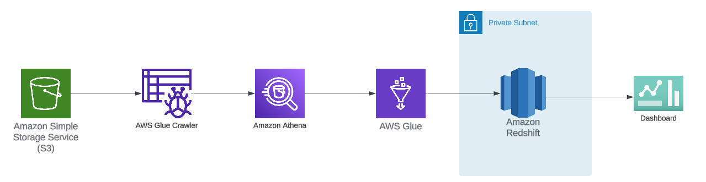

This project was inspired from https://www.youtube.com/watch?v=gFWu-SSzRzc&list=PLBJe2dFI4sgvavQzL2Hm5CsnoIWHY5fI3&index=2

data was taken from AWS covid data lake https://dj2taa9i652rf.cloudfront.net/

Archeticure Diagram

Steps
- After downloading the data create s3 bucket name 'covid-etl-de-project'.

Uppload data to s3 bucket
aws s3 cp {FILE_PATH} s3://{BUCKET_NAME}/{KEY_PATH} --recursive

commands:
aws s3 cp \enigma-jhud s3://covid-etl-de-project/enigma-jhud --recursive
aws s3 cp \enigma-nytimes-data-in-usa s3://covid-etl-de-project/enigma-nytimes-data-in-usa --recursive
aws s3 cp \rearc-covid-19-testing-data s3://covid-etl-de-project/rearc-covid-19-testing-data --recursive
aws s3 cp \rearc-usa-hospital-beds s3://covid-etl-de-project/rearc-usa-hospital-beds --recursive
aws s3 cp \static-datasets s3://covid-etl-de-project/static-datasets --recursive

- Create Crawler, you hvae too create DB also
- Make for each sub-folder a crawler with its name, test it using athena if the data is correct

- Unfinished project